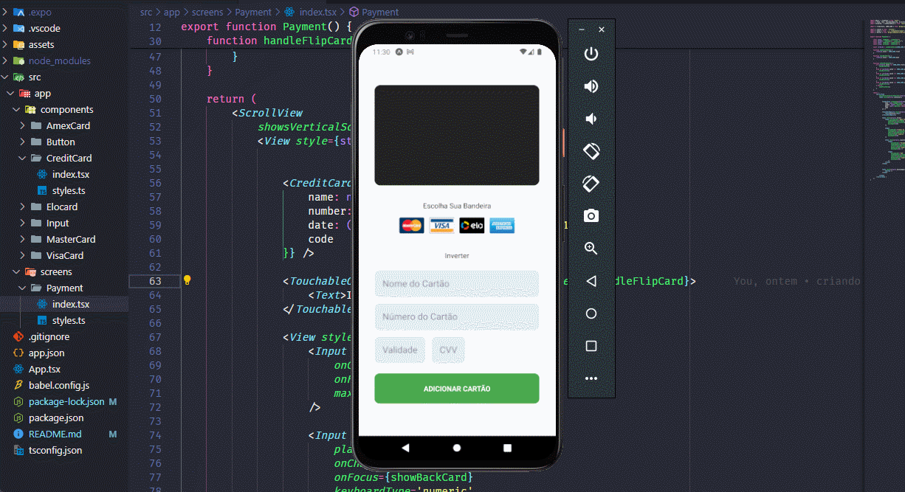

<div align="center">
  
</div>

<h1 align='center'>
 <p>Credit Card</p>
</h1>

### 📕 About

Application that allows you to add your credit and debit cards.

#

<div align="center">
  
</div>

#

### ❓ Why the app

Project idea made by [orodrigogo](https://github.com/orodrigogo) in the YouTube video: https://www.youtube.com/watch?v=qKGh8pUuBaU&pp=ygUScm9kcmlnbyBnb27Dp2FsdmVz, with some additional features implemented by me, such as the buttons to choose the card flag, allowing the card to be rotated and visually changed according to the flag, data formatting through input, and the add button that I used useState to show the user the visual change of the inactive button after to click .

#

### ⛏️ Tools used

- [Expo](https://docs.expo.dev/)
- [TypeScript](https://www.typescriptlang.org/docs/)
- [React Native](https://reactnative.dev/docs/getting-started)
- [React Reanimated](https://www.reanimated2.com/docs/fundamentals/getting-started)

#

### 🤝🏽 How to contribute

You need to have [Node](https://nodejs.org/en/download), [Git](https://git-scm.com/download/win) and [VsCode](https://code.visualstudio.com/download) installed on your computer.

And to run the application, simply download [Expo Go](https://play.google.com/store/apps/details?id=host.exp.exponent&hl=pt_BR&gl=US) on your smartphone.

Or install the [Android emulator](https://developer.android.com/studio?hl=pt-br) on your computer and download Expo Go from the Play Store using the emulator.

#### Follow the step by step

````bash
    # Clone the project
    $ git clone git@github.com:dan-ia/CreditCard.git

    # Enter directory
    $ cd CreditCard
````
````bash
    # Install the dependencies, if use npm
    $ npm install
````
<p align="center">or</p>

````bash
    # Install the dependencies, if use yarn
    $ yarn
````

```` bash
     # Open project in VsCode
     code .

     # Start server
     npx expo start
````
<div align="center">

<h3> Any questions? Contact me! 🩵✌️</h3>

[](https://www.linkedin.com/in/dan-ia/)
[](mailto:danieillsilvarv411@gmail.com)


</div>

